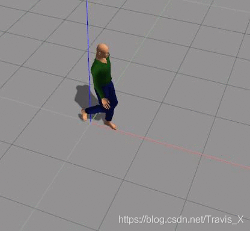
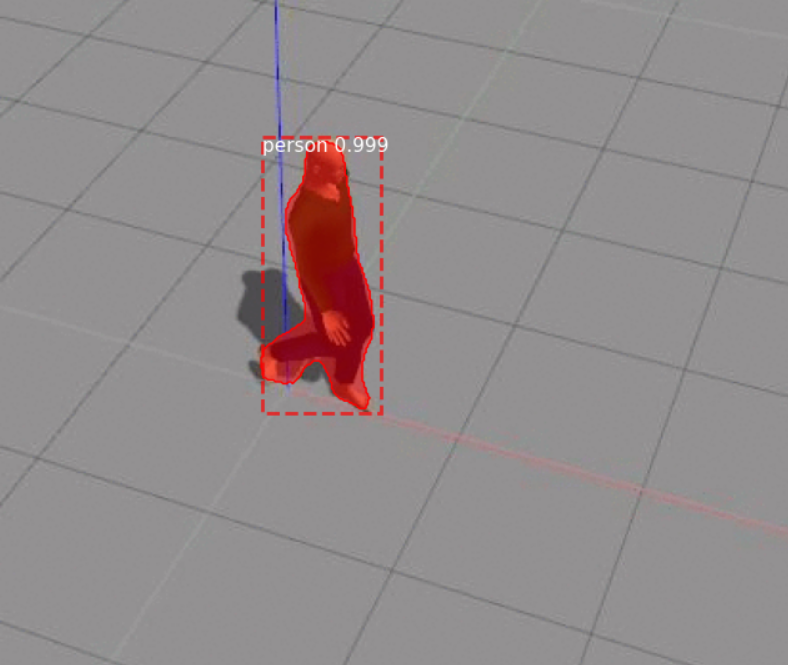
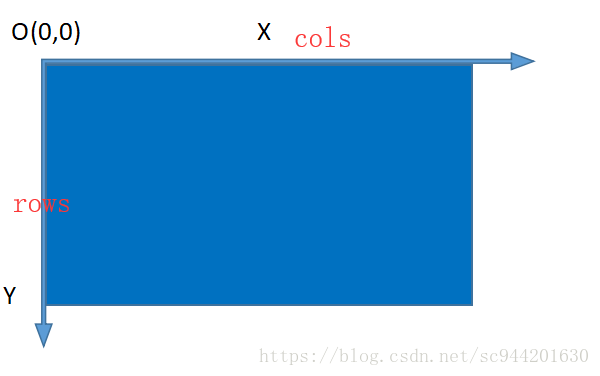
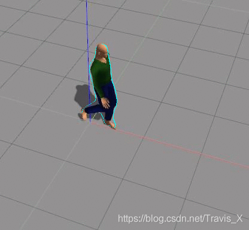
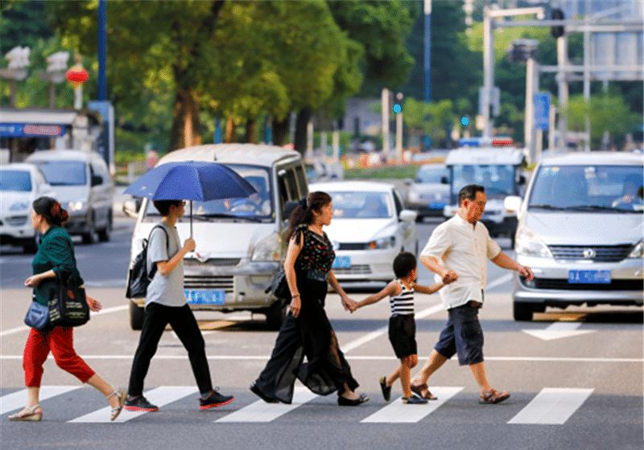

# 使用Turtlebot3对人体目标进行测距跟踪

## 一、使用maskrcnn实现对目标的精准检测与人体轮廓检测

### maskrcnn介绍

Mask R-CNN是一个实例分割（Instance segmentation）算法，可以用来做“目标检测”、“目标实例分割”、“目标关键点检测”。要注意语义分割是与实例分割不同的，语义分割中实现了对不同类别物体的识别，实例分割则是对其进行进一步的识别，下面这张图比较清晰地解释了之间的区别。

可以看出maskrcnn能够很好地识别目标，并且对人体轮廓进行更好的描绘，非常利于我们跟踪目标。

### maskrcnn有多棒？

### 实践

首先，maskrcnn的源码有训练好的模型，如果有需要可以再次训练，但是对于我们来说其实并不需要。我们目的是为了识别目标，并且在仿真环境中的actor特征差距并不明显，选择使用其上衣独特的颜色进行识别跟踪。下载源码，进行学习与改写

[1]: https://github.com/matterport/Mask_RCNN

maskrcnn发布已经过去很长时间了，但仍有学习与参考价值。在源码中有教学的脚本，我们将其修改为main.py，其中我们检测的图像为（csdn上拔的一张，角度很好）：

检测的结果为：

可以看出，gazebo中的actor模型也能很好的检测出来。这样的轮廓已足够满足我们的要求，可以很好的将人体的特征覆盖，使用深度相机对范围内的图像坐标点进行测量就可以获得目标的距离。

### 进行特征点的提取

在maskcnn提取了绘制的特征点后，需要对其进行进一步的处理。在opencv中，图像有x、y两个坐标轴，如图：

对于上图中覆盖的图片，比如其中一个锚点为(x0,y0),由于在图像平面上，物体一定拥有左侧和右侧，所以对应某一x0值，还有一个或者多个y值，可以比较其之间的相对大小，找到一个x0坐标对应最大的y和最小的y，这个物体就在最大值与最小值的内部，对这些坐标点进行测距，计算平均距离，可以得到比较准确的距离。

### 寻找最大最小值并进行绘制

按照上面的算法实现周围轮廓特点的描绘，直接给这些“最大最小”值对应像素点赋以像素以便观察，如图为按照自己的想法处理的效果：

蓝色点即为进行最大最小值寻找获得的值，实现了猜想。在gazebo中，actor的特点差异并不明显，打算按照actor的衣服颜色进行识别，在上一次实验中检测了红色物块，所以这次检测行人也继续沿用这个颜色（后来发现他的衣服并不是红色），因为已经知道了目标人在图片中的范围，所以使用遍历像素点rgb色彩值的方法统计目标身上的红色像素点，把红色像素点最多的目标最为跟踪目标。在百度上随便找张图片进行测试：

检测后：

处理后：

红色裤子大婶身上的红色像素点最多，我们把她作为目标，效果也很理想。

### 与ros结合的问题

起初，maskcnn是非常好的检测算法，这种精度已经非常了不起了，但是结合ros发现原先遗漏的问题，就是使用模型进行检测速率非常之慢，10s一帧的速度根本没办法控制车体……因为对python不甚了解，并不太会优化网络，只能将其抛弃。

## 二、使用yolo—fatest模型结合C++进行目标识别、并对识别框内进行普通图像处理获得轮廓

在使用maskrcnn彻底失败后，小组成员心情非常低落，但是往往失败是成功他妈，在最大最小值提取猜想实现后，目的变得更加明显了——寻找更加优质的算法，在浏览公众号【opencv与Ai深度学习】时，发现了一篇使用yolo加C++实现目标检测的文章，作者将代码发布在了github[hpc203/yolov34-cpp-opencv-dnn: 基于opencv的4种YOLO目标检测，C++和Python两个版本的实现，仅仅只依赖opencv库就可以运行 (github.com)](https://github.com/hpc203/yolov34-cpp-opencv-dnn),这个模型依旧不需要进行训练，已经是训练很好的模型了，我们将代码配置到自己的环境里，进行效果的检测：

可以发现其检测速度极快，在这样的条件下，只需要不到20s就能完成一次图片的检测，当然视频是一帧一帧播放的，每一帧的检测大概为20ms，这样的时间对于车体控制完全满足要求。寻找到目标后需要对目标进行一般的轮廓检测，以实现预期的效果。过程中对目标图像进行了基本的处理：灰度化，二值化，均值模糊，开闭运算就能实现基本的轮廓描绘，但效果极差，只能描绘身体较为明显的部分，如图：

基本的身体轮廓已经可以描绘了，接下来需要和ros控制部分联合起来。

## 三、ros中追踪目标

在之前，目标轮廓已经被我们找到，我们需要将其融入ros节点的控制部分，这一部分很简单，在原先的方块追踪程序中增加人体测距函数并引入轮廓绘制函数，就能实现跟踪。

过程中小车为什么会发飘？因为视频中物体小车与人体间距离较近，我们的小车追踪目标判断是通过上衣的颜色加上简单的轮廓绘制，所以有时小车稍加晃动就可能找不到目标。上图为目标静止时，下图为目标移动：

## 四、边缘检测实现尽可能的把人体特征选入

这一部分的说明就暂时不加了，难度不大，Canny可以轻松实现，当然整体的效果在简单环境还是可以的，但是复杂环境中还是有所欠缺，像在图的单一色调环境中很好去检测，未来还是需要多在实例分割上下下功夫吧。

因为最终没有通过实例分割实现，所以小车在跟踪人体时，环境内如果仅有一人还是可以的（上图不是最后效果，最后的效果放在了ppt里，就不给大家多多赘述了），但是对于多人的话，像素点的判断很容易出错，而且gazebo中actor模型的颜色不是很纯，红不红，绿不绿，用色彩限制的话范围很小很容易出错，实在是看不下去了哈，如果不是学业压力所迫（考研），本打算考虑再多做一阵子的……但现在实在不行，目前也是按照学长要求把文件传至github上。实验里用了很多东西，但是包都太大了，而且也只是过程中尝试，所以就不上传了。

感谢学长哦，已经关注你的github了，学了不少东西